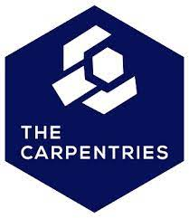

# group-website
Repo for learning how to make websites with Jekyll and GitHub pages)

## contents
* [learning markdown](#learning-markdown)
* [Carpentries lesson programs](#carpentries-lesson-programs)

## learning markdown

Vanilla text contain *italics* and **bold**.

This paragraph is separated form the previous one by a blank line.
Line breaks  
are caused by two trailing spaces at the end of a line.

[Capentries website](https://carpentries.org/)

### Carpentries lesson programs:
1. software carpentry
2. data carpentry
3. library carpentry
    1. section 1
    2. section 2
4. philosopers carpentry

carpentries logo copyright carpentries 2022.
